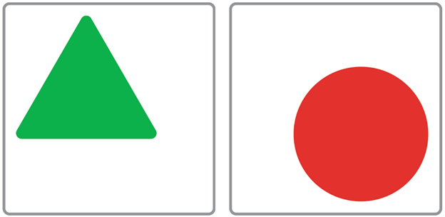
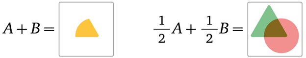
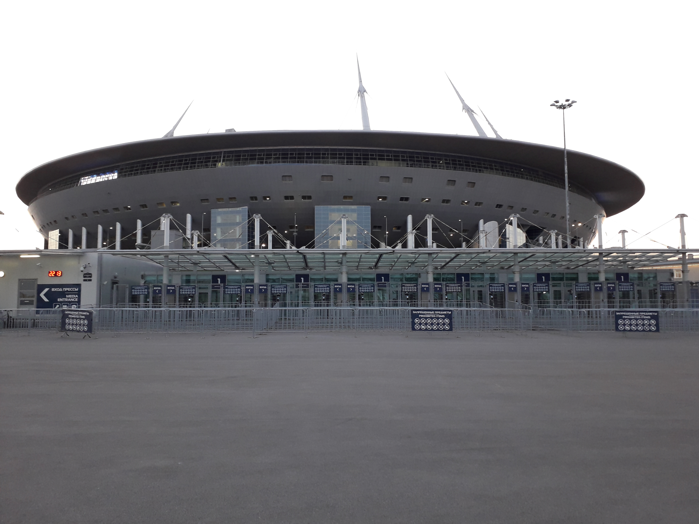
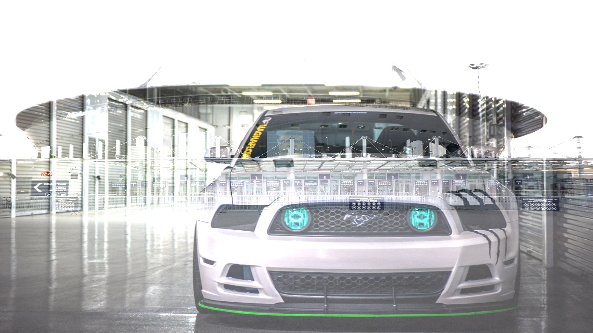
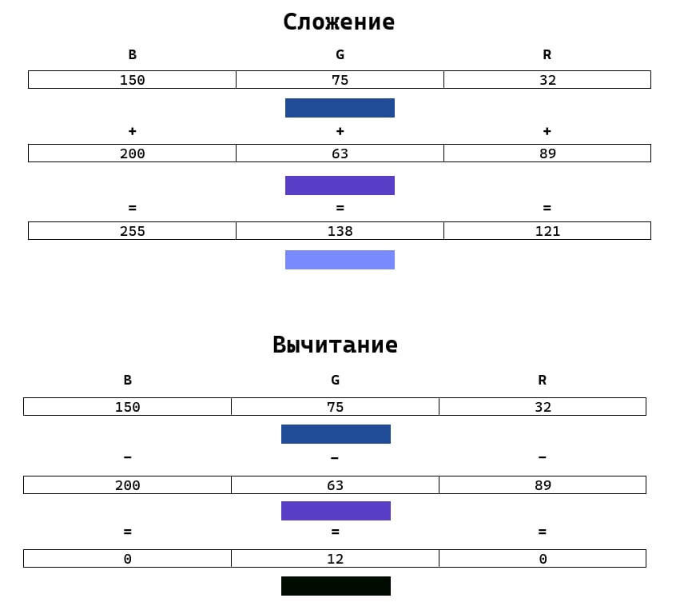
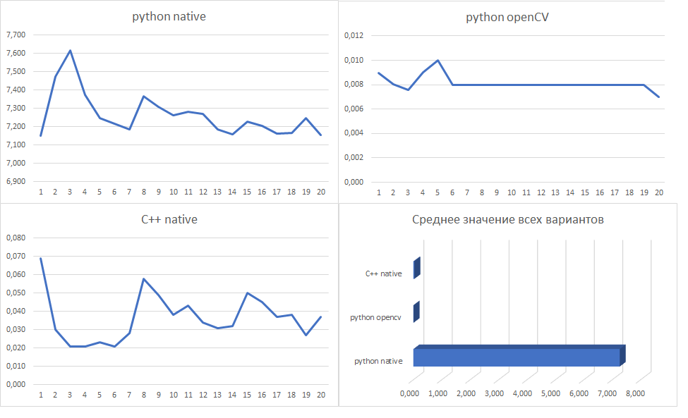
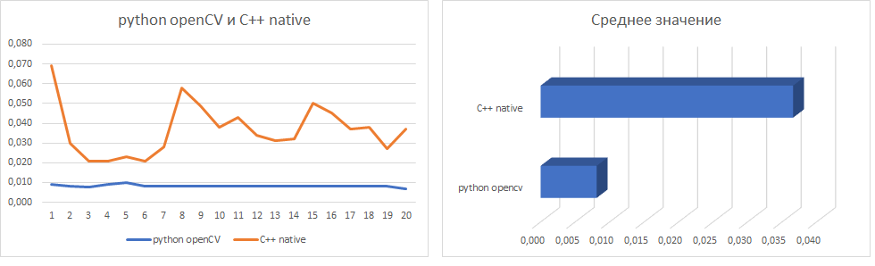

<h1 align="center">Лабораторная работа №1.</h1>

<h2 align="center">Вариант-8. Сложение и вычитание изображений.</h2>

<h4 align="center">Теоретическая база</h4>

Изображения, представленные в компьютере, можно складывать и вычитать, умножать и даже возводить в степень! Именно на арифметических операциях основана работа компьютерных программ с растровыми изображениями, таких как Photoshop или инструментов для обработки фотографий в социальных сетях.
Растровое изображение можно представлять как светящуюся картинку на экране — это прямоугольная таблица, состоящая из ячеек (пикселей). В каждой из них хранится числовой набор (r; g; b), характеризующий яркость трёх базисных цветов (красный, зелёный, синий), из которых складывается цвет пикселя. Целые числа r, g и b хранятся в виде байтов: каждая двоичная запись состоит из восьми нулей и единиц, поэтому диапазон значений — от 0 до 255. Значение 0 означает отсутствие данного цвета в комбинации, значение 255 — яркость цвета максимальна. Примеры: (0; 0; 0) — чёрный пиксел, (255; 255; 255) — белый, (255; 0; 0) — красный и т. д.
Арифметические операции над изображениями выполняются попиксельно и покомпонентно. Для одинаково расположенных пикселей (r1, g1, b1) и (r2, g2, b2) их сумма равна (r1+r2; g1+g2; b1+b2). В сложении сумма принимается равной 255, если она больше этого числа. В общем, при сложении получается более яркая точка, при умножении — менее яркая. Например, прибавление к картинке белого фона обесцвечивает всю картинку, превращая её в «белое безмолвие». А если умножить цветную картинку на «чёрный квадрат», то образуется квадратная «чёрная дыра».

<figure>
  <p></p>
  <figcaption align="center"></figcaption>
</figure><br>

Непосредственные результаты применения введённых операций обескураживают. Взяв зелёный треугольник (А) и красный круг (B), в сумме A+B получим жёлтый ломтик в пересечении. Если взять «по половине изображений» 0,5A+0,5B, уменьшив вдвое яркости всех составляющих, то треугольник и круг по форме сохранятся, но изменятся по цвету: в пересечении фигур будет тёмное пятно, а дополняющие части станут светлее.

<figure>
  <p align="center"></p>
  <figcaption align="center"></figcaption>
</figure><br>

Базовые операции рассматривались в простейшей модели, с обработкой по отдельным пикселям. Но используются и инструменты, которые меняют цвет пикселя с учётом цветов окружающих пикселей. Например, усреднение цветов даёт эффект размытия фотографии.

<h4 align="center">Описание разработанной системы</h4>

OpenCV — это open source библиотека компьютерного зрения, которая предназначена для анализа, классификации и обработки изображений. Широко используется в таких языках как C, C++, Python и Java.

<h4> Работа состоит из 3 части: </h4>

1. Загрузка изображений;
2. Сложение и вычитание изображений;
3. Вывод изображений после сложении и вычитании;

Загрузка изображений:

```
img1 = cv2.imread('Images/ford.jpg')
img2 = cv2.imread('Images/img1.jpg')
```

Мы загружаем две изображений которые нужны в дальнейшем сделать операции над ними. 
Например:

<figure>
  <p align="center"></p>
  </figure>
  <p align="center"><i>Первое исходное изображения</i></p><br>

<figure>
  <p align="center"></p>
  </figure>
  <p align="center"><i>Второе исходное изображения</i></p><br>

<b>Сложение изображений</b>

Посмотрим процесс сложение:
```
img_add = addImages(img1,img2)
```

Напишем функцию который выполняет сложение изображений:

```
def addImages(img1, img2):
    img2 = cv2.resize(img2, dsize=(img1.shape[1], img1.shape[0]))
    imgAdd = cv2.add(img1, img2)
    return imgAdd
```

<b><i>В итоге у нас получается:</b><i>

<figure>
  <p align="center"></p>
</figure>
<p align="center"><i>Результат 1</i></p><br>

<figure>
  <p align="center"></p>
</figure>

<b>Вычитание изображений</b>

Теперь посмотрим процесс вычитание:

```
img_subtract = subtractImages(img1,img2)
```

Напишем функцию который выполняет вычитание изображений:

```
def subtractImages(img1, img2):
    img2 = cv2.resize(img2, dsize=(img1.shape[1], img1.shape[0]))

    imgSubtract = cv2.subtract(img1, img2)
    return imgSubtract
```

<b><i>В итоге у нас получается:</b><i>

<figure>
  <p align="center"></p>
  </figure>
  <p align="center"><i>Результат 2</i></p><br>

<b>Вывод изображений после сложении и вычитании</b>

Вывод изображений происходить с помощью функции:

```
cv2.imshow('Result', cv2.resize(img_show, dsize=(1000, 700)))
```

<p align="center"><b>Результаты работы и сравнения системы</b></p>

Проведём сложение и вычитание изображений в трёх вариантах: Python OpenCV, Python native и C++ native.

В каждом из вариантов мы проведём по 20 тестов и выясним среднее время выполнения сложение и вычитание. Ниже приведены графики отношения времени к номеру теста для каждого из вариантов и гистограмма среднего времени выполнения.

<figure>
  <p align="center"></p>
 </figure>
  <p align="center"><i>Сравнение вариантов</i></p><br>

  Здесь видно, что у нас python native медленее чем остальные. Поэтому мы его не будем расматривать.

  <figure>
  <p align="center"></p>
 </figure>
  <p align="center"><i>Сравнение python OpenCV и  C++ native</i></p><br>

  На графиках видно, что самый эффективный вариант это у нас python OpenCV.

  <p align="center"><b>Вывод</b></p>
  Мы в ходе выполнение лабораторной работы узнали следующие: Работать с изображениями в языке Питон с использованием библиотеки OpenCV гораздо легче и код работает быстрее.
